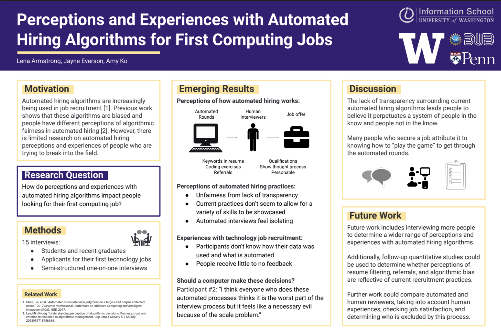

## Publications

**Lena Armstrong** and Danaë Metaxa. “Navigating Automated Hiring: Fairness Perceptions, Strategy Use, and Outcomes Among Young Job Seekers.” _(accepted to CSCW 2025)_

**Lena Armstrong**, Abbey Liu, Stephen MacNeil, and Danaë Metaxa. “[The Silicon Ceiling: Auditing GPT's Race and Gender Biases in Hiring](https://doi.org/10.1145/3689904.3694699)." EAAMO 2024.

**Lena Armstrong**, Jayne Everson, Amy J. Ko. [“Navigating a Blackbox: Students' Experiences and Perceptions of Automated Hiring.”](https://faculty.washington.edu/ajko/papers/Armstrong2023AutomatedHiring.pdf) ICER 2023. 

Jean Salac, Alannah Oleson, **Lena Armstrong**, Audrey Le Meur, Amy J. Ko. “[Funds of Knowledge used by Adolescents of Color in Scaffolded Sensemaking around Algorithmic Fairness](https://faculty.washington.edu/ajko/papers/Salac2023AdolescentAlgorithmicFairness.pdf).” ICER 2023. **[BEST PAPER]**

Jean Salac, **Lena Armstrong**, Megumi Kivuva, Jayne Everson, Alannah Oleson, Amy J. Ko. “How Economically-Marginalized Adolescents of Color Negotiate Critical
Pedagogy in a Computing Classroom.” _(accepted to TOCE)_

## Honors & Awards 

- National Science Foundation Graduate Research Fellowship (2024)

- College Alumni Society Prize for Research in Cognitive Science (2023)
  
- Computer Science Academic Award (2023)

- Max Mintz Undergraduate TA Hall of Fame (2023)

- Phi Beta Kappa (2023)
 
 

## Posters

**Design Use Build (DUB) REU Program (June - August 2022)**

- Advisor: [Prof. Amy J. Ko](https://faculty.washington.edu/ajko) (_[Center for Learning, Computing, and Imagination](https://faculty.washington.edu/ajko/lab), University of Washington_)

- **Perceptions of Automated Hiring:** created a project to determine first-time job seekers’ perceptions and experiences with automated hiring algorithms to determine bias and opacity [[Poster](https://drive.google.com/file/d/1UyxGvT0-nu_sn6QEYdcHQVPNW3HBybPa/view?usp=sharing)]

  
 
 

**HCII Summer Undergraduate Research Program (June - August 2021)**

- Advisor: [Prof. Amy Ogan](https://www.amyogan.com/) (_Human Computer Interaction Institute, Carnegie Mellon University_)

- **Design-Based and Data-Driven Approach to Supporting Teachers in Low Infrastructure Contexts:** worked on a chatbot to support hundreds of teachers in low infrastructure contexts in Côte d’Ivoire [[Poster](https://drive.google.com/file/d/1dgRMjN74YXSNIuabXClYMu3LJKMMRVH7/view?usp=sharing)]

 
 

**Penn Center for Neuroengineering and Therapeutics (May 2020 - December 2021)**

- Advisor: [Prof. Kathryn Davis](https://davislab.med.upenn.edu/) (_Davis Lab, University of Pennsylvania_)

- **Machine learning of EEG to help diagnose epilepsy:** created a pipeline to predict brain functional connectivity from structural connectivity with Python using brain network analysis and machine learning techniques [[Poster for Penn Fall Research Expo](https://presentations.curf.upenn.edu/poster/machine-learning-eeg-help-diagnose-epilepsy-predicting-functional-connectivity-structural)]

  
 
 

## Work and Leadership Experiences

- Head Teaching Assistant for Introduction to Human Computer Interction [(CIS 4120/5120)](https://emoneil.github.io/cis4120-5120/#schedule)
  
- Head Teaching Assistant for Introduction to Computer Programming [(CIS 1100)](https://www.cis.upenn.edu/~cis110/current/staff.html)

- Project Manager and UN Liaison at an NGO [Hecho por Nosotros](https://www.hechoxnosotros.org/) working to improve the sustainability of the fashion industry through transparency & traceability techology

- Women in Computer Science [(WICS)](https://wics.cis.upenn.edu/program.html) President

- [PennGreen](https://sustainability.upenn.edu/participate/students/penngreen-pre-orientation) Co-Director (sustainability-focused orientation program for first-year students)

- [West Philadelphia Tutoring Project](https://upennwptp.weebly.com/) tutor for middle school students in STEM

- [FemmeHacks](https://femmehacks.io/) mentor at inclusive hackathon for women and non-binary people 
 
 

---

<small>Theme from <a href="https://github.com/orderedlist">orderedlist</a> & <a href="https://github.com/evanca">evanca</a></small>

